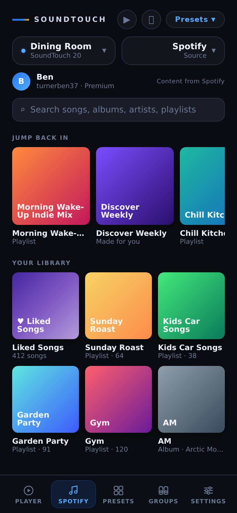
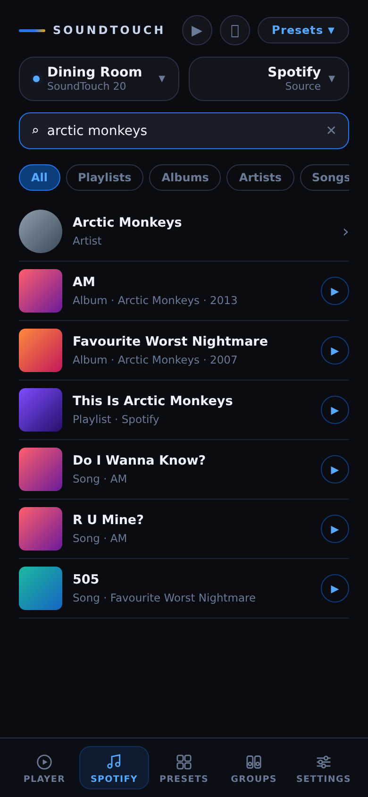
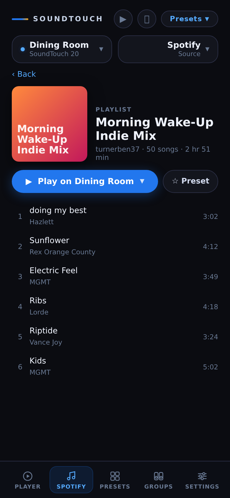
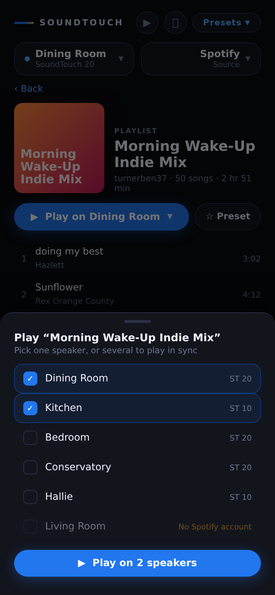
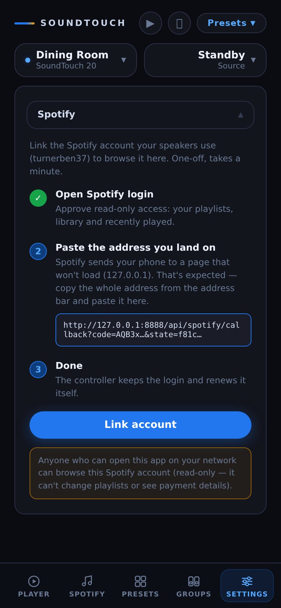

# Plan: Spotify browser in the web app

**Status:** proposal, nothing built yet · **Branch:** `feature/spotify-browser` · **Supersedes the approach in** #72, and cuts #70 down to one account

## Recommendation

Build it. It's worth doing, and it's a lot smaller than #72 suggested, because of something we've found since #72 was written:

> **The speakers can already play any Spotify playlist on their own.** In October we stored a playlist as a preset on the Dining Room ST20. From standby, it played on the speaker's own linked Spotify account (`turnerben37`) through a single local `/select` call. No phone and no Spotify Web API were involved.

So playback is solved. What's left is the **browsing**: search, your playlists and your library. That needs the Spotify Web API, but only read-only access.

#72 planned to play via the Web API's transfer-playback, plus a ZeroConf credential push for a second account. Neither is needed for the main use case.

## How it works

```
 Phone (web app)                 Controller (Python)                   Cloud / LAN
 ───────────────                 ───────────────────                   ───────────
 Spotify tab ── search / list ─▶ /api/spotify/* proxy ── read-only ──▶ Spotify Web API
                                  (holds the token,                     (api.spotify.com)
                                   browser never sees it)
 tap ▶ Play ─────────────────▶  /api/spotify/play ─── /select ──────▶ ST speaker :8090
                                  builds the ContentItem:               plays it on its own
                                  SPOTIFY / tracklisturl /              linked account
                                  /playback/container/<b64 uri>
```

- **Browse:** the Web API, authorised once with OAuth PKCE using read-only scopes: `playlist-read-private`, `user-library-read`, `user-read-recently-played`. Since it's PKCE, there's no client secret to store.
- **Play:** the same local ContentItem format as presets. For example, `spotify:playlist:0NF0Mryk…` is base64-encoded into `/playback/container/…`, with `sourceAccount="turnerben37"`.
- **Speakers:** only speakers with that account linked and `READY` get Spotify as an option. That's every speaker except the Living Room soundbar, which has no account linked. The same rule (`preset_target_ok()`) already drives "Save what's playing → All speakers".

## Spotify's rules that shape the design

| Rule (checked October 2026) | What it means here |
|---|---|
| Redirect URIs must be HTTPS, except the loopback IPs `http://127.0.0.1` / `[::1]`. `localhost` and LAN IPs are not allowed (enforced for new apps from April 2025). | The controller's `http://10.10.10.111:8888` can't be the redirect. So the one-off login is a **paste-back**: Spotify redirects the phone to `http://127.0.0.1:8888/…`, the page fails to load (expected), and you paste that address into the app. See screen 5. |
| Since November 2024, new apps can't read **Spotify-owned / algorithmic playlists** (Discover Weekly, Daily Mix, editorial), recommendations or featured/category playlists. | These can't be browsed or searched into, but they can still be **played**. The speaker doesn't use the Web API, as the Discover Weekly preset already shows. They also still work through "Save what's playing". |
| Development-mode apps are limited to a small allow-list of named users. | Fine: it's one household and one account. Register a personal app in the Spotify Developer Dashboard. |
| Brand guidelines. | Show "Content from Spotify", don't crop or alter artwork, and don't use the Spotify logo as our icon. The mockups use a generic music-note tab icon. |

## Screens

All mockups are at phone width, in the app's real styling (`docs/plans/spotify-browser/mockup.html`). Covers are placeholders: the real build shows Spotify's artwork.

| 1 · Spotify tab (home) | 2 · Search | 3 · Playlist |
|---|---|---|
|  |  |  |
| **Jump back in** (recently played contexts) and **Your library** (Liked Songs, your playlists, saved albums). The speaker/source pickers stay at the top, so the active speaker is the default target. | One box searches playlists, albums, artists and songs, with filter chips. ▶ plays straight away on the active speaker. Artists open a page with top albums. | Cover, details and tracks. The primary **Play on Dining Room ▾** button goes to the active speaker, and ▾ opens the speaker sheet. **☆ Preset** saves it to a slot, reusing the existing save-preset code. |

| 4 · Speaker sheet | 5 · Link account (Settings) |
|---|---|
|  |  |
| Pick one speaker, or several to play in sync (creates a group via the existing zone API, then plays on the master). Speakers that can't play it are greyed out with the reason. | One-off setup with the paste-back flow, explained in plain terms, plus an up-front note that anyone on the LAN can browse the account read-only. |

## Backend

New `SpotifyClient` class and `/api/spotify/*` endpoints (GET, matching the existing API style):

| Endpoint | Does |
|---|---|
| `/api/spotify/status` | linked? display name, product (Premium), which speakers can play |
| `/api/spotify/login` | returns the authorise URL (PKCE `code_challenge`, `state`) |
| `/api/spotify/link?url=` | takes the pasted callback URL, checks `state`, exchanges the code, stores the tokens |
| `/api/spotify/unlink` | forgets the tokens |
| `/api/spotify/home` | recently played contexts, playlists, saved albums, Liked Songs count (cached ~60 s) |
| `/api/spotify/search?q=&type=` | `/v1/search` |
| `/api/spotify/item?uri=` | playlist / album / artist detail and tracks |
| `/api/spotify/play?uri=&hosts=` | builds the ContentItem and `/select`s it. With several hosts it makes a zone first |

- **Tokens:** stored in `data/spotify/account.json` with mode `0600`, refreshed automatically about 60 s before expiry, and never logged or sent to the browser. `data/` is already gitignored.
- **Client ID:** from `$SPOTIFY_CLIENT_ID` or `data/spotify/app.json`. It isn't secret with PKCE, but it's kept out of the repo anyway.
- **Rate limits:** honour `429 Retry-After`, and cache responses briefly so scrolling doesn't hammer the API.
- **Front end:** a separate `web/spotify.js` module rather than growing `app.js`, which is already ~1,800 lines.

## Phases

**Phase 0: spikes (do first; each one can change the plan)**

1. **Other content types:** does `/select` play **albums**, **artists**, **Liked Songs** (`spotify:user:<id>:collection`) and **single tracks** the same way playlists do? Playlists are proven. If tracks don't work, tapping a song plays its album instead, or see 2.
2. **Starting at a track:** can playback start at a chosen track? Probably not via `/select`. The fallback is Web API `PUT /me/player/play` with `offset`. The speaker is already in `turnerben37`'s Connect device list, but this needs the extra `user-modify-playback-state` scope.
3. **Login flow:** does the paste-back flow work on iPhone, and how long do refresh tokens last for a dev-mode app?
4. **Spotify-made playlists:** does `/v1/me/playlists` still *list* Spotify-made playlists you follow, with name, art and URI, even though their tracks are blocked? If so, Discover Weekly can still appear as a tile.

**Phase 1: backend.** `SpotifyClient`, the token store, the endpoints above, and unit tests with mocked Web API responses. Done when `/api/spotify/home` returns real data and `/api/spotify/play` starts a playlist on an ST20.

**Phase 2: UI.** Spotify tab (home, search, detail), the speaker sheet, and the Settings link card. Album art feeds the existing full-bleed background. Done when you can browse and play from the phone.

**Phase 3: extras that come almost free**
- ☆ Preset from any playlist or album, without having to play it first. Generalise `/api/presets/save-current` to accept a URI.
- **Alarms that play a Spotify playlist directly** rather than a preset slot. Alarms keep working when presets change.
- "Play on all speakers" via the existing group/party API.

**Rough size:** Phase 0 is one short session. Phases 1 and 2 are a couple of sessions each. Phase 3 is one session.

## Risks

- **Spotify could end the speakers' built-in support** (it's a Bose integration, and Bose has exited). It works today. If it stopped, presets would break too, so the browser adds no new exposure.
- **Spotify Web API policy keeps tightening.** We use only plain read-only library and search endpoints, which have been stable.
- **The controller has no login.** Anyone on the Wi-Fi could browse the linked account, but only read-only: the scopes can't modify playlists or see billing. Spike 2 would add `user-modify-playback-state`, and that's the point to revisit this.
- **Second Duo account:** private playlists belonging to the *other* Duo member won't play, because the speakers play as `turnerben37`. This is out of scope here. #70/#71's multi-account and ZeroConf work would be the route if it's ever wanted.

## Open questions for Ben

1. Should Spotify be a 5th tab, as mocked, or open from the **Source ▾** picker when you choose Spotify?
2. Is single-account (yours, the one the speakers use) enough? It keeps things simple.
3. Is it OK to create a personal Spotify developer app? It takes about 5 minutes in the dashboard, and only you can do it because it's tied to your Spotify login.
